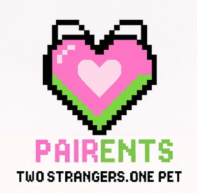

# Security Policy

## Supported Versions

I actively maintain and support the latest version of this project. If you are using an older version, please consider upgrading to benefit from the latest fixes :)

| Version | Supported          |
| ------- | ------------------ |
| 2.7.1   | :white_check_mark: |
| < 2.7.1 | :x:                |

## Reporting a Vulnerability

If you discover a security vulnerability in this project, please do **not** open a public issue. Instead, contact me directly and privately at:

**majachlipala@student.agh.edu.pl**

Please provide:

- A detailed description of the vulnerability
- Steps to reproduce it
- Any potential impact it may have

I will respond promptly to acknowledge your report and work on fixing the issue.

## Security Updates

Once a vulnerability is confirmed, I will:

- Fix the issue as quickly as possible
- Publish an update with the fix
- Notify users via release notes or other appropriate channels

## Thank You

Thank you for helping me keep this project secure!

|  | **Pairents** | **Maja Chlipała** | **VI.2025** |
|:--:|:--:|:--:|:--:|
